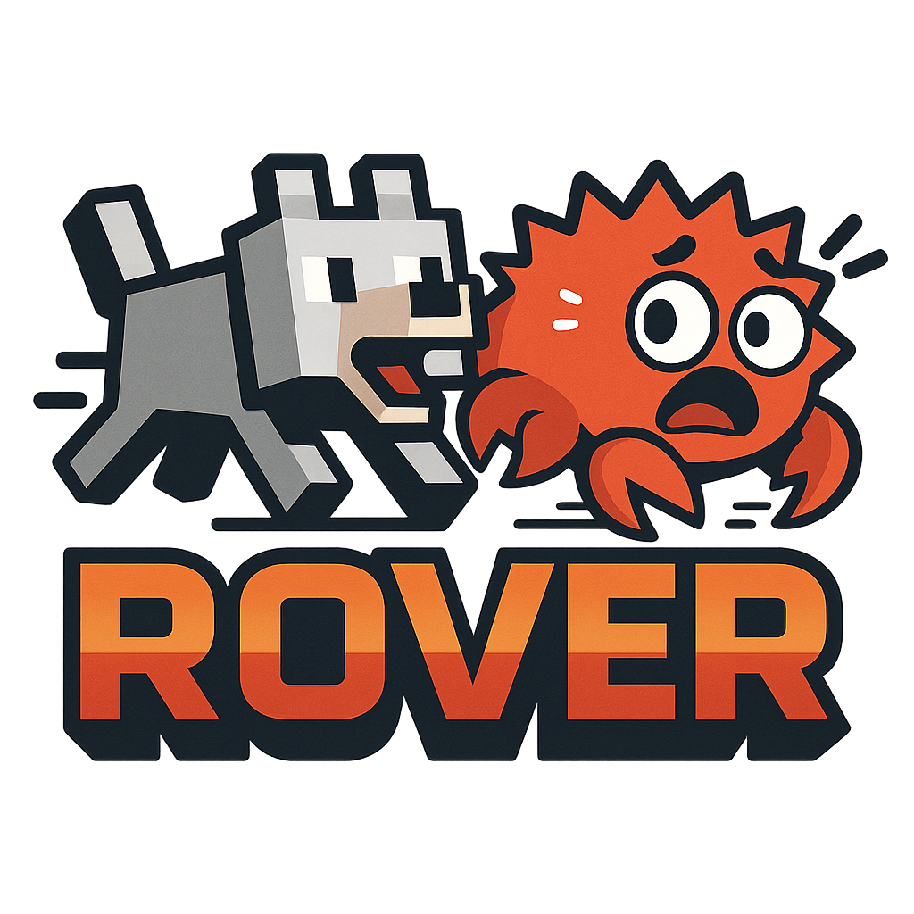

<div align="center">
  
  
  # RoverNet
  
  **High-performance game server software built with Rust and the Rover Bedrock library**
  
</div>

[](https://www.rust-lang.org/)
[](https://discord.gg/rovernet)

## What is RoverNet?

RoverNet is an extremely powerful, blazingly fast, and resource-efficient server software written in Rust using the Rover Bedrock library. It aims to be highly customizable through a comprehensive API, extensive plugin system, and flexible configuration options that give server owners complete control over every aspect of their game experience.

## ⚡ Key Features

- **Performance First** - Built in Rust for speed and efficiency
- **Fully Extensible** - Comprehensive API for total control
- **Plugin System** - Create custom game modes and mechanics
- **Developer Friendly** - Well-documented with modern tooling

## 🚀 Quick Start

```bash
# Clone the repository
git clone https://github.com//ansar10123/rovernet
cd rovernet

# Build and run
cargo build --release
./target/release/rovernet
```

## 🔧 Example Plugin

```rust
use rovernet::prelude::*;

#[plugin]
pub struct MyPlugin;

#[event_handler]
async fn on_player_join(event: PlayerJoinEvent) {
    event.player.send_message("Welcome to RoverNet!");
}
```

## 📚 Documentation

Coming soon - We're working on comprehensive docs!

## 🤝 Contributing

RoverNet is in early development. We welcome contributions!

## 📄 License

MIT License - see LICENSE file for details
